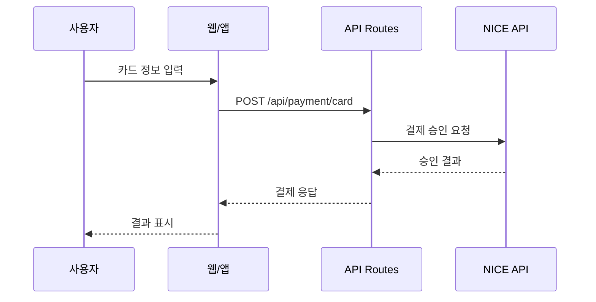
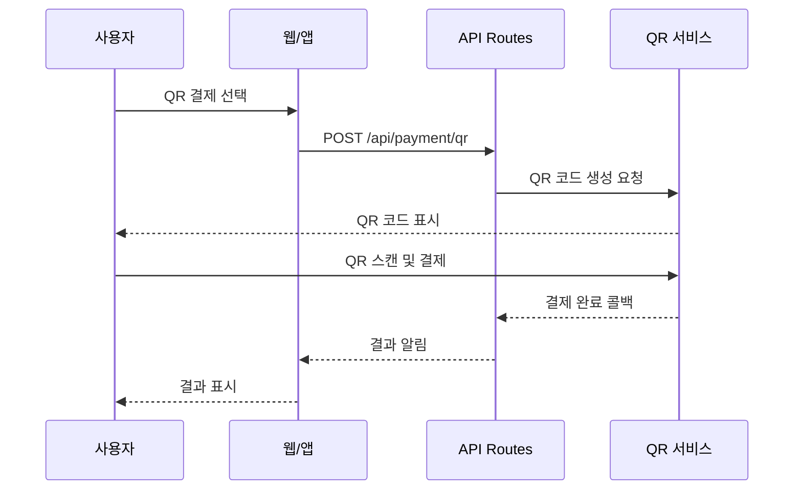

# NICE POS - 통합 결제 시스템 POC

웹과 앱을 모두 지원하는 NICE 결제 시스템 POC입니다.

## 🎯 주요 기능

- **💳 카드 결제**: 신용/체크카드 결제 승인 및 취소
- **📱 QR 결제**: 제로페이, 카카오페이, 네이버페이, 삼성페이
- **🧾 현금영수증**: 개인 소득공제 및 사업자 지출증빙
- **📋 결제 내역**: 거래 내역 조회 및 관리

## 🏗️ 아키텍처

```
┌─────────────────────────────────────────────┐
│            웹 (Next.js)                      │
│            앱 (React Native)                 │
└─────────────────┬───────────────────────────┘
                  │
                  │ HTTP/REST API
                  │
┌─────────────────▼───────────────────────────┐
│        Next.js API Routes                    │
│  /api/payment/card                          │
│  /api/payment/qr                            │
│  /api/payment/cashreceipt                   │
│  /api/payment/history                       │
└─────────────────┬───────────────────────────┘
                  │
                  │
┌─────────────────▼───────────────────────────┐
│         NICE API Client                      │
│  (시뮬레이션 모드 / 실제 API)                │
└─────────────────────────────────────────────┘
```

### 왜 이 구조인가?

1. **Next.js API Routes**: 프론트엔드와 백엔드가 하나의 프로젝트에서 동작
2. **공통 타입 정의**: TypeScript로 타입 안정성 보장
3. **시뮬레이션 모드**: 실제 NICE API 없이도 테스트 가능
4. **확장 가능**: RESTful API 구조로 다른 클라이언트에서도 사용 가능

## 🚀 시작하기

### 1. 의존성 설치

```bash
npm install
```

### 2. 개발 서버 실행

```bash
npm run dev
```

브라우저에서 [http://localhost:3000](http://localhost:3000) 접속

### 3. 빌드 및 배포

```bash
npm run build
npm start
```

## 📁 프로젝트 구조

```
nice-pos/
├── app/                      # Next.js App Router
│   ├── api/                 # API Routes (백엔드)
│   │   └── payment/
│   │       ├── card/        # 카드 결제 API
│   │       ├── qr/          # QR 결제 API
│   │       ├── cashreceipt/ # 현금영수증 API
│   │       └── history/     # 결제 내역 API
│   ├── layout.tsx           # 루트 레이아웃
│   ├── page.tsx             # 메인 페이지
│   └── globals.css          # 글로벌 스타일
│
├── components/               # React 컴포넌트
│   ├── PaymentCard.tsx      # 카드 결제 UI
│   ├── PaymentQR.tsx        # QR 결제 UI
│   ├── CashReceipt.tsx      # 현금영수증 UI
│   └── PaymentHistory.tsx   # 결제 내역 UI
│
├── lib/                     # 라이브러리
│   ├── nice-api.ts          # NICE API 클라이언트
│   └── utils.ts             # 유틸리티 함수
│
└── types/                   # TypeScript 타입
    └── payment.ts           # 결제 관련 타입
```

## 🔄 결제 흐름

### 1. 카드 결제 흐름



**상세 단계:**

1. 사용자가 카드 정보 입력 (카드번호, 유효기간, 할부개월 등)
2. 프론트엔드에서 `/api/payment/card`로 POST 요청
3. API Routes에서 입력 검증
4. NICE API 클라이언트 호출 (시뮬레이션 모드에서는 Mock 응답)
5. 거래 ID, 승인 번호 생성
6. 결과를 프론트엔드로 반환
7. 사용자에게 결과 표시

### 2. QR 결제 흐름



### 3. 현금영수증 발행 흐름

1. 사용자가 금액과 식별 정보 입력 (휴대폰 번호 또는 사업자번호)
2. `/api/payment/cashreceipt`로 POST 요청
3. 영수증 타입 검증 (개인/사업자)
4. NICE API를 통해 국세청 전송
5. 승인 번호 발급
6. 사용자에게 영수증 URL 제공


## 🔌 API 문서

### POST /api/payment/card

카드 결제 승인

**Request:**
```json
{
  "amount": 10000,
  "cardNumber": "1234-5678-9012-3456",
  "expiryMonth": "12",
  "expiryYear": "25",
  "installment": 0,
  "orderName": "커피 2잔",
  "customerName": "홍길동"
}
```

**Response:**
```json
{
  "success": true,
  "transactionId": "TXN1234567890abcdef",
  "approvalNumber": "12345678",
  "approvedAt": "2024-01-01T12:00:00Z",
  "amount": 10000,
  "method": "CARD",
  "status": "APPROVED",
  "message": "결제가 승인되었습니다.",
  "receiptUrl": "/receipt/TXN1234567890abcdef"
}
```

### POST /api/payment/qr

QR 결제 승인

**Request:**
```json
{
  "amount": 10000,
  "qrType": "KAKAO_PAY",
  "orderName": "커피 2잔",
  "customerPhone": "010-1234-5678"
}
```

**Response:**
```json
{
  "success": true,
  "transactionId": "TXN1234567890abcdef",
  "approvalNumber": "12345678",
  "approvedAt": "2024-01-01T12:00:00Z",
  "amount": 10000,
  "method": "QR",
  "status": "APPROVED",
  "message": "KAKAO_PAY 결제가 승인되었습니다.",
  "receiptUrl": "/receipt/TXN1234567890abcdef"
}
```

### POST /api/payment/cashreceipt

현금영수증 발행

**Request:**
```json
{
  "amount": 10000,
  "receiptType": "PERSONAL",
  "phoneNumber": "010-1234-5678",
  "orderName": "커피 2잔"
}
```

**Response:**
```json
{
  "success": true,
  "transactionId": "TXN1234567890abcdef",
  "approvalNumber": "12345678",
  "approvedAt": "2024-01-01T12:00:00Z",
  "amount": 10000,
  "method": "CASH_RECEIPT",
  "status": "APPROVED",
  "message": "현금영수증이 발행되었습니다.",
  "receiptUrl": "/receipt/TXN1234567890abcdef"
}
```

### DELETE /api/payment/card

카드 결제 취소

**Request:**
```json
{
  "transactionId": "TXN1234567890abcdef",
  "cancelAmount": 10000,
  "cancelReason": "고객 요청"
}
```

**Response:**
```json
{
  "success": true,
  "transactionId": "TXN1234567890abcdef",
  "amount": 10000,
  "method": "CARD",
  "status": "CANCELLED",
  "message": "결제가 취소되었습니다."
}
```

### GET /api/payment/history

결제 내역 조회

**Query Parameters:**
- `page`: 페이지 번호 (기본값: 1)
- `limit`: 페이지당 항목 수 (기본값: 10)
- `method`: 결제 방법 (CARD, QR, CASH_RECEIPT)
- `status`: 결제 상태 (PENDING, APPROVED, CANCELLED, FAILED)
- `startDate`: 시작일 (YYYY-MM-DD)
- `endDate`: 종료일 (YYYY-MM-DD)

**Response:**
```json
{
  "success": true,
  "items": [
    {
      "transactionId": "TXN1234567890abcdef",
      "approvalNumber": "12345678",
      "amount": 10000,
      "method": "CARD",
      "status": "APPROVED",
      "orderName": "커피 2잔",
      "customerName": "홍길동",
      "createdAt": "2024-01-01T12:00:00Z"
    }
  ],
  "total": 100,
  "page": 1,
  "limit": 10
}
```

## 🧪 테스트

### 시뮬레이션 모드 테스트

현재는 시뮬레이션 모드로 동작합니다:

- 카드번호 15자리 이상: 승인
- 카드번호 15자리 미만: 거부
- 모든 QR 결제: 2초 후 자동 승인
- 현금영수증: 1초 후 자동 발행

### 실제 NICE API 연동

1. `.env.local` 파일 생성:
```bash
NICE_SIMULATION_MODE=false
NICE_CLIENT_ID=your_client_id
NICE_SECRET_KEY=your_secret_key
NICE_API_URL=https://api.nicepay.co.kr
```

2. `lib/nice-api.ts`에서 실제 API 호출 구현

## 🔒 보안 고려사항

1. **카드 정보 암호화**: 실제 환경에서는 카드 정보를 암호화하여 전송
2. **HTTPS 필수**: 프로덕션에서는 반드시 HTTPS 사용
3. **토큰 인증**: API 호출 시 JWT 등의 인증 토큰 사용
4. **PCI DSS 준수**: 카드 정보 처리 시 PCI DSS 규정 준수
5. **민감 정보 로깅 금지**: 카드 번호, CVV 등은 로그에 남기지 않음

## 📈 다음 단계

### 프로덕션 준비

- [ ] 실제 NICE API 연동
- [ ] 데이터베이스 연동 (PostgreSQL, MySQL 등)
- [ ] 사용자 인증 시스템 (JWT, OAuth)
- [ ] 결제 실패 재시도 로직
- [ ] 웹훅 처리 (결제 상태 변경 알림)
- [ ] 에러 모니터링 (Sentry 등)
- [ ] 로깅 시스템

### 기능 확장

- [ ] 부분 취소 기능
- [ ] 정기 결제 (구독)
- [ ] 환불 처리
- [ ] 결제 영수증 PDF 생성
- [ ] 대시보드 및 통계
- [ ] 정산 관리


## 📞 문의

프로젝트에 대한 문의사항이 있으시면 이슈를 등록해주세요.

## 📄 라이선스

ISC
